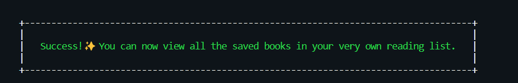

# 💾 CLI Reading List

## Table of Contents

- [Installation](#installation)
- [What is it?](#what-is-it)
- [What does it do?](#what-does-it-do)
- [Tech Choices](#tech-choices)
- [Next Steps](#next-steps)
- [Edge Cases](#edge-cases)
- [Running Tests](#running-tests)

## [Installation](#installation)
- Clone the repo `git clone https://github.com/fairyaksh/reading_list.git`
- Ensure all required npm packages are installed using `npm install` or `npm i`
- Create a Google Cloud Platform account and enable Google Books API, collect your API key credentials [(Learn more).](https://developers.google.com/books/docs/v1/using#APIKey)
- Create a `.env` file and store your API Key inside it as an environmental variable [(Learn more).](https://www.freecodecamp.org/news/how-to-use-node-environment-variables-with-a-dotenv-file-for-node-js-and-npm/)
- Run `tcli` into your terminal to start the CLI application

## [What is it?](#What-is-it?)
- This project is a Command Line Interface application that connects to [Google Books API](https://developers.google.com/books/docs/overview) services and searches for books given the user's search query.
- It has been built using NodeJS and a CLI interface package named [Inquirer](https://github.com/SBoudrias/Inquirer.js).

## [What Does It Do?](#What-Does-It-Do?)
- The user journey of the application allows for:
    - [x] The user to type in a search query and display a list of 5 books matching that query.
    - [x] The user to view each item in the list, including the book's author, title, and publishing company.
    - [x] The user to select a book from the list that they wish to save to a 'reading list'.
    - [x] The user to view a 'reading list' with all the books the user has selected from their queries through a local reading list.

## [Tech Choices](#Tech-Choices)
- I used the [Inquirer](https://github.com/SBoudrias/Inquirer.js) package as, after thorough research, it seemed to be the most commonly used and active npm package for implementing seamless CLI interaction with the user whilst allowing for the use of hierarchical prompts. 
- I used the [dotenv](https://www.npmjs.com/package/dotenv) package to manage my environment variables, storing my API keys securely and thus allowing for authorised connection to Google Books API through [Google Cloud Platform](https://console.developers.google.com/apis).
- I used the [clear](https://www.npmjs.com/package/clear) package to clear the terminal after each Inquirer prompt to improve the userflow of the application, making it more user-friendly.
- I used [chalk](https://github.com/chalk/chalk) to add text styling to my console logs and then [boxen](https://github.com/sindresorhus/boxen) to style the outer box of the message in the terminal.

## [Next Steps](#Next-Steps)
I would like to discuss the changes I would make if I had more time or were to build on this application in the future:
- I would abstract each Inquirer prompt and store it as an array of `questions` inside another file, to then be imported into the `index.js` file. 
This is to implement modularisation and keep the code clean and readable.
- I would implement authentication through a login/password flow so that the user does not have to type their name each time they wish to search for a book. 
This will also mean the initial prompt that asks the user their name will be conditional; only prompted if current user is not logged in. The application will keep track of the user session and store a reading list that is specific to that user's account.
- I would write tests for the remaining functions in my `index.js` file that require testing fetch requests and the fs library 

## [Edge Cases](#Edge-Cases)
- I checked for system errors through `try, catch`, and fetch request error handling through the response `status` and error logging.
- I handled asynchorous operations through `async, await` error handling.
- I checked for common edge cases with the data returned from the Google Books API fetch request: checking if resolved object's property exists and if the resolved object's data type is as expected. 

## [Running Tests](#Running-Tests)
- Run `npm t` or `npm run test` to run all tests in Jest in your terminal
- Currently testing the pure JavaScript functions in `index.js` file